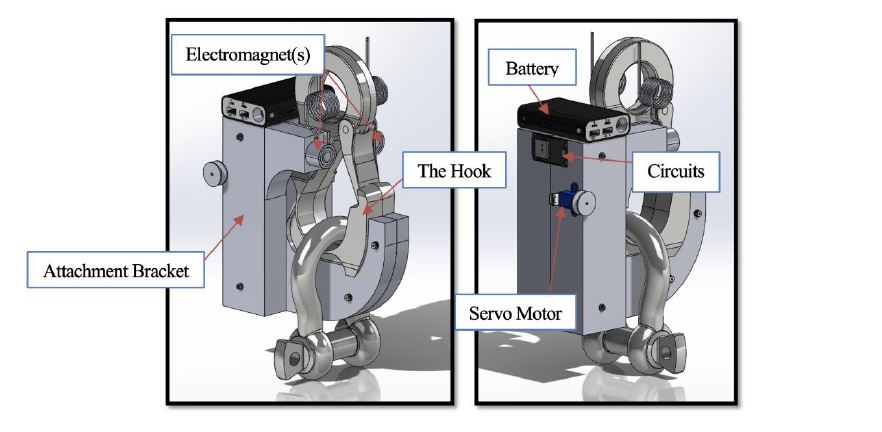
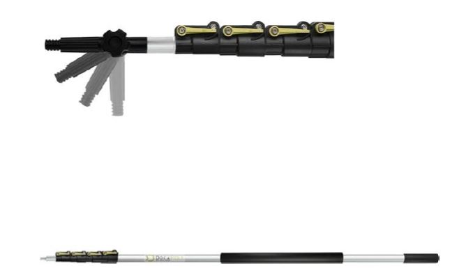
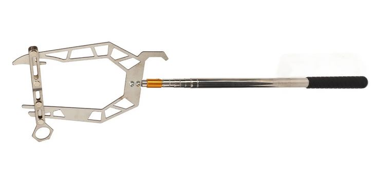
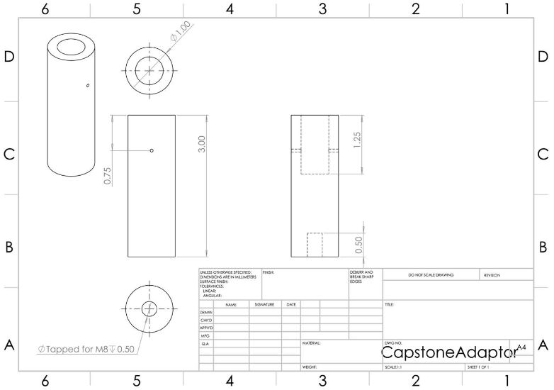
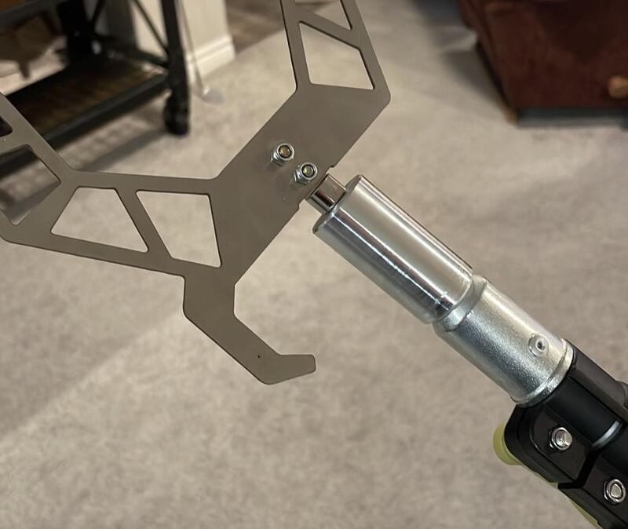
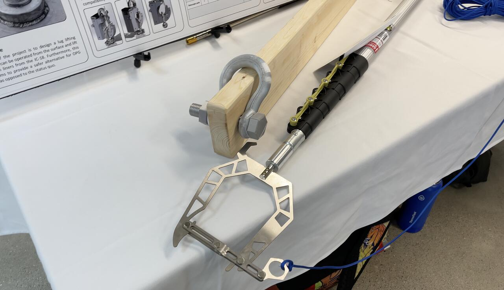
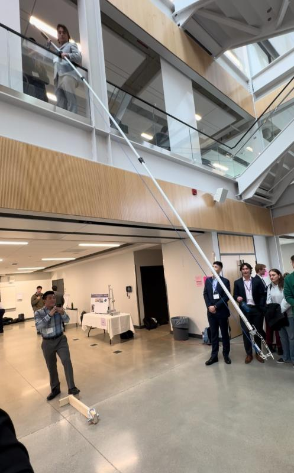
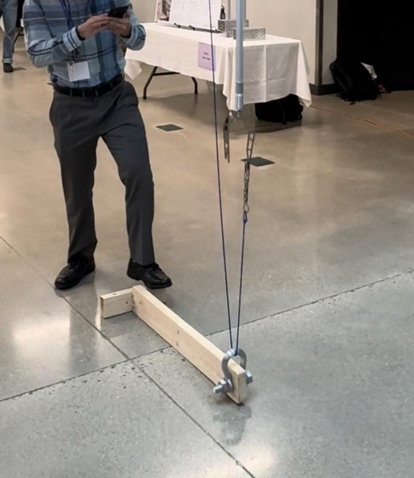

[← Back to Home](../)

# Surface-Operated Resin Liner Retrieval System

---

## Overview
At Ontario Power Generation (OPG), resin waste is stored in cylindrical liners housed within the IC-18 inground storage structures. Each structure extends approximately 40-ft below grade and contains six resin liners stacked vertically. Every resin liner includes a lifting lug to allow handling during storage operations.

  

---

## The Problem
The existing retrieval process required workers to enter the IC-18 structure on scaffolding to manually thread a crane sling through the lifting lug, exposing them to fall hazards and C-14 radiation while only reaching two of six resin liners. This project developed a surface-operated system to safely retrieve all six liners.

  

    
    
<em>Lifting lug schematic</em>

  

  

    
    
<em>Lug variation 1</em>

  

  

    
    
<em>Lug variation 2</em>

  

---

## Initial Design Concept
Given the initial constraints, a **Hook-Gate Controller with Magnets** was developed. This design concept intended to eliminate the need for a crane lifting sling. The device would attach to the crane and be lowered into the IC-18, where electromagnets would raise the lifting lug into position and a remotely controlled gate would secure it for lifting.

  
  
<em>Hook-Gate Controller with Magnets</em>

## Major Design Pivot
This concept assumed the lifting lugs were ferrous. However, discussions with OPG later revealed that not all lifting lugs were magnetic. In addition, OPG preferred a method that looped a lifting sling through the lug rather than using a lifting hook. These new requirements prompted a significant design pivot.

The updated approach focused on creating a simple, surface-operated threading method. A 30-ft telescopic pole was selected to provide rigidity and precise control, replacing the idea of suspending tools from a cable.

  
  
<em>7 to 30 Foot Extendable Pole</em>

To thread the sling through the lifting lug, a hook-threading tool was incorporated. This concept was inspired by fishing tools used to pass lines around mooring points, which offered a simple and reliable way to guide a rope through a stationary object.

  
  
<em>Hook Threader</em>

## Prototype Construction

A custom adapter was designed and CNC machined from 6061-T4 aluminum to connect the telescopic pole and hook-threading tool. One end features a tight transitional fit over the pole threads, while the opposite end is tapped with an M8 thread compatible with the hook threader. The adapter was bonded to the pole using Sikaflex-221 to create a rigid prototype for the final design presentation.

  

    
    
<em>Adapter CAD Drawing</em>

  

  

    
    
<em>Machined Adapter</em>

  

## Design Day Presentation
The project concluded with a showcase event, where the prototype and a replica lifting lug assembly were presented to the judges and the public.

  
  
<em>Prototype</em>

The presentation included a successful live demonstration of the device. The project earned 3rd place overall out of 25 teams.

  

    
    
<em>Demonstration Part 1</em>

  

  

    
    
<em>Demonstration Part 2</em>

  

  
  
<em>3rd Place Certificate</em>

[← Back to Home](../)
