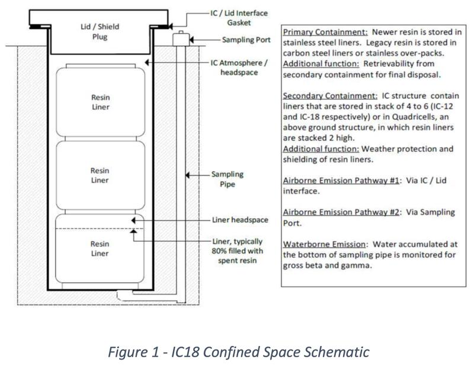
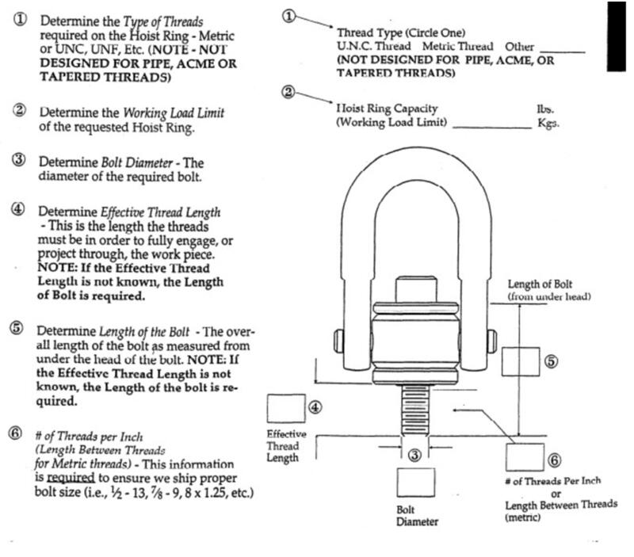
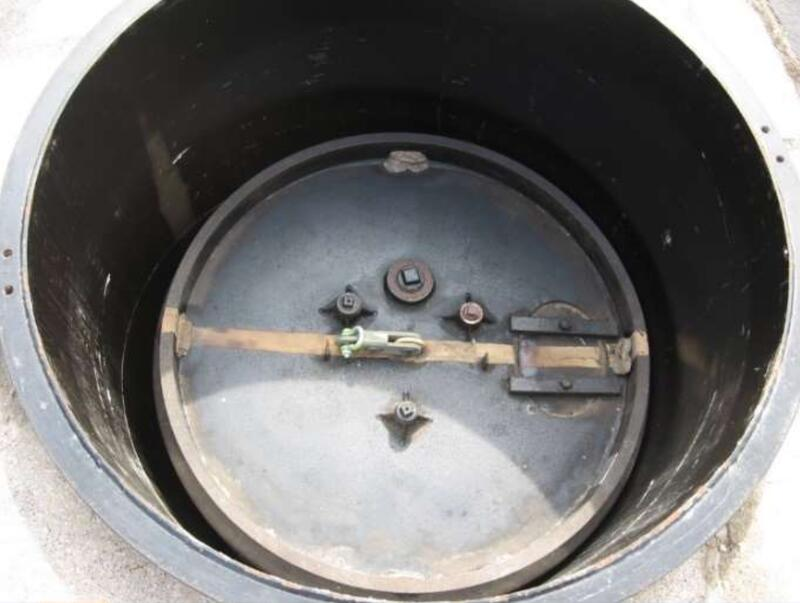
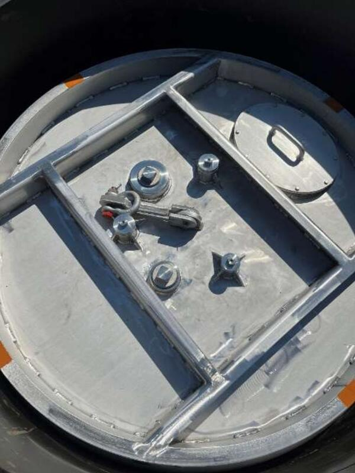

[← Back to Home](../)

# Surface-Operated Resin Liner Retrieval System

---

## Overview
At Ontario Power Generation (OPG), resin waste is contained in cylindrical resin liners, which are placed in the IC-18 inground structures. The IC-18 extends 40ft into the ground and contains 6 resin liners stacked on top of each other. The resin liners have a lifting lug on the top for transporting the lines in or out of the IC-18. 

  
  
<em>IC-18 schematic</em>

---

## The Problem
The current method of retrieval requires an individual to go down into the IC-18 using scaffolding, and manually thread the crane lifting sling through the lifting lug. This approach takes around 4 hours from start to finish. In addition, this method of retrieval has a big problem of putting the workers at risk of C-14 radiation exposure and the risk of falling. Our team was tasked by OPG to come up with a solution to thread these lugs entirely from the surface.

  

    
    
<em>Lifting lug schematic</em>

  

  

    
    
<em>Lug variation 1</em>

  

  

    
    
<em>Lug variation 2</em>

  

---

## The Solution
[Describe how the tool works here — mechanism, key features, materials used.]

  

---

## Process
As timeline and budget manager, I tracked project milestones, allocated resources, and kept the team on schedule throughout the design and fabrication cycle. I also played a significant role in shaping the direction of the final design — contributing to key decisions on [mechanism/material/approach].

[Add more detail about design iterations, testing, and fabrication here.]

  

  

---

## Results
The final prototype successfully demonstrated surface-operated retrieval, eliminating confined-space entry entirely. The project was awarded 3rd place at the Mechanical Engineering capstone presentation.

[Add any performance metrics, test results, or reflections here.]

---

[← Back to Home](../)
