[← Back to Home](../)

# CRT Television Repair & Restoration

---

## Backstory
I found this on Facebook Marketplace listed as parts only. It's Bratz-themed Cathode Ray Tube (CRT) television from the early 2000s. These specialty kids' sets were made in limited quantities and are now rare and collectible. The housing was missing a few screws and the display was messed up, but I was drawn to the challenge.

I've been into CRT technology for a while now and I collect them for the retro gaming events I run. This deal was too good to pass up.

  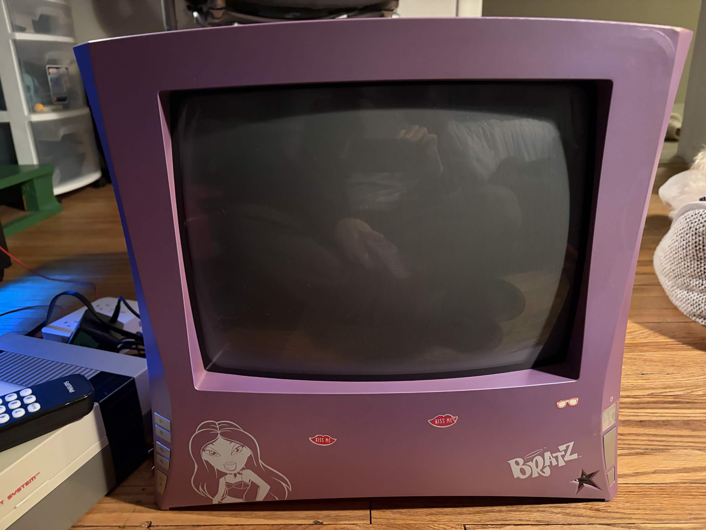
  
<em>Bratz CRT TV</em>

---

## Initial Assessment
It powered on, which was promising. But the picture had a black bar across the top, the whole image was tilted at an angle, and each side of the screen were bowing inward. I ran it through a display testing tool to get a better read on what I was dealing with. It was clear this CRT needed to be taken apart.

  

    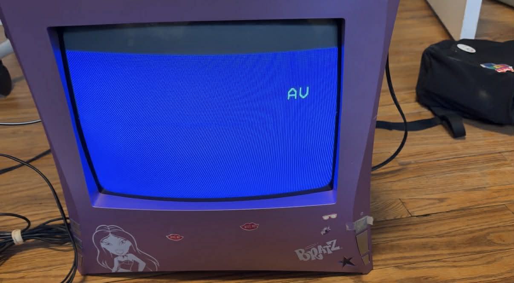
    
<em>CRT Powered On</em>

  

  

    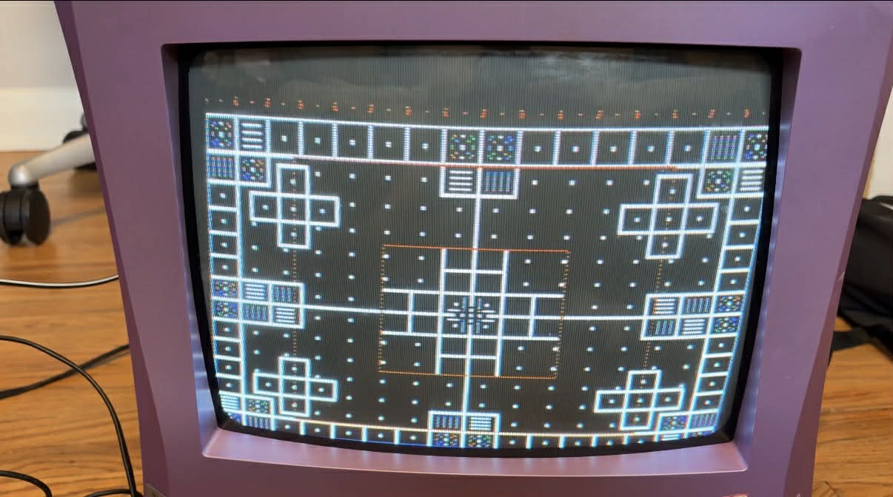
    
<em>Display Geometry Issue</em>

  

  

    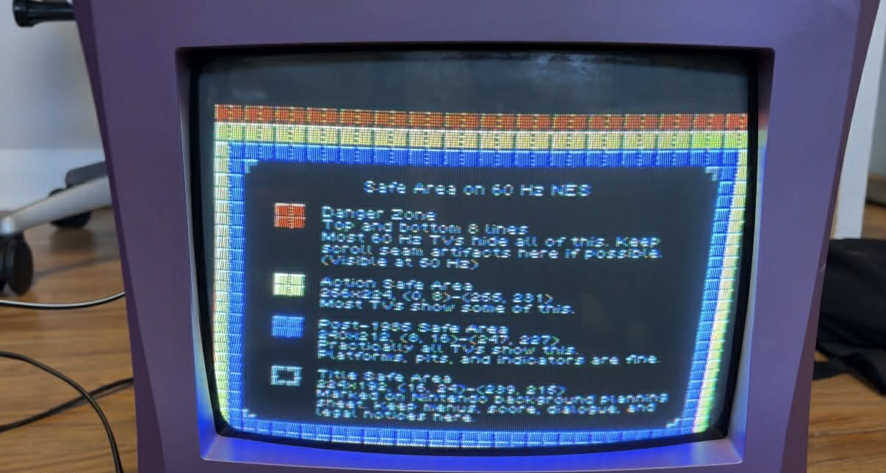
    
<em>Display Borders Issue</em>

  

---

## Teardown
Once I got inside, two things stood out immediately. A blown capacitor on the neckboard, which was almost certainly the cause of the black bar. And the epoxy that's supposed to hold the yoke in place had completely dried out and crumbled, letting the yoke shift and causing the tilt. The inside was also covered in dust, so I got that cleaned out before anything else.

  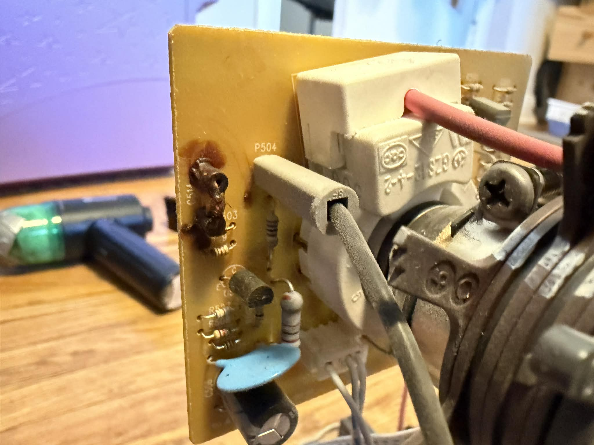
  
<em>Faulty Capacitor</em>

---

## Diagnosis
I tracked down the service manual for a similar CRT by cross-referencing the circuit board model. Going through the electrical schematic, I was able to pinpoint the specs of the blown capacitor and figure out what I needed to order.

  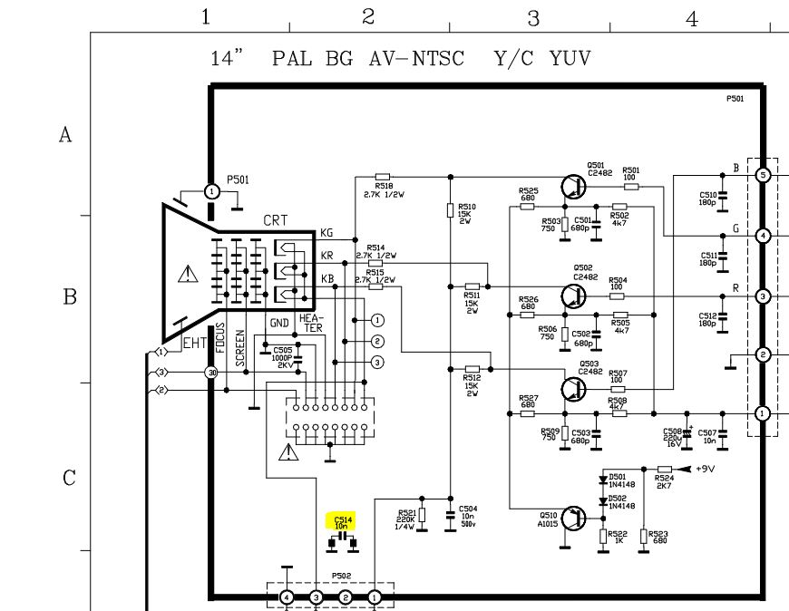
  
<em>Circuit Board Schematic</em>

---

## The Fix
I ordered a replacement capacitor with a higher voltage rating to future-proof the repair. Before touching anything on the board, I properly discharged the CRT. These tubes store high voltage even after being powered off and unplugged, making this a critical safety step. I then desoldered the blown capacitor and soldered the new one in place.

For the tilt, I pryed off the metal brackets holding the tube assembly and — with insulated rubber gloves on — carefully rotated the tube back into position. Once aligned, I used fresh epoxy to lock it in place.

  

    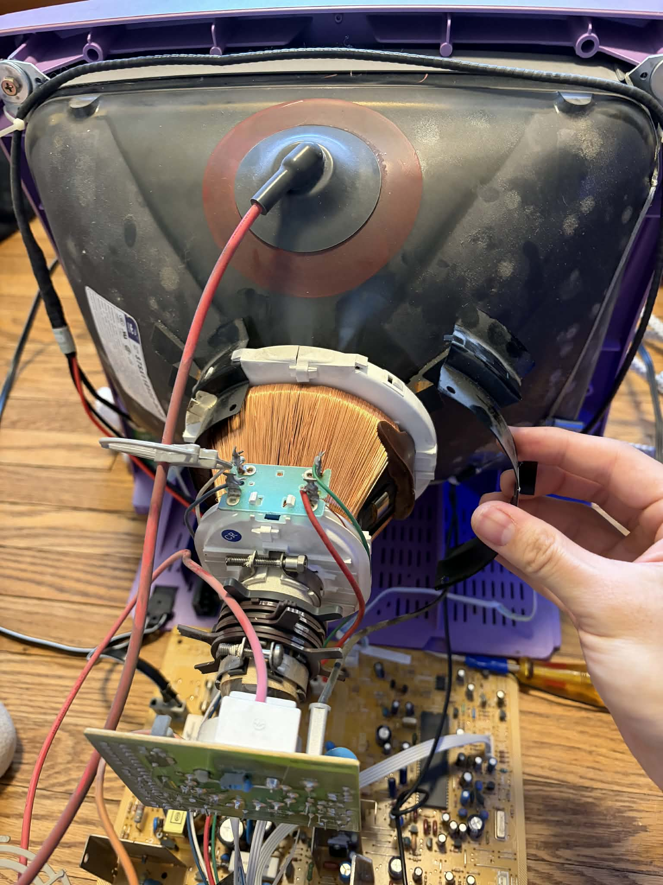
    
<em>Metal Bracket</em>

  

  

    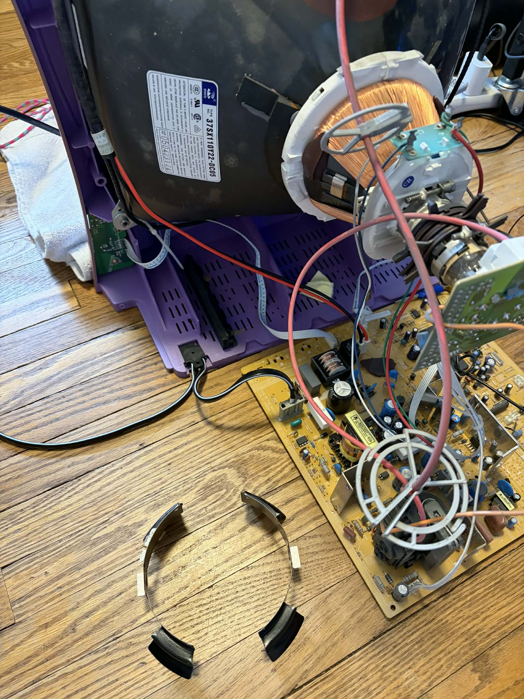
    
<em>Both Brackets Removed</em>

  

  

    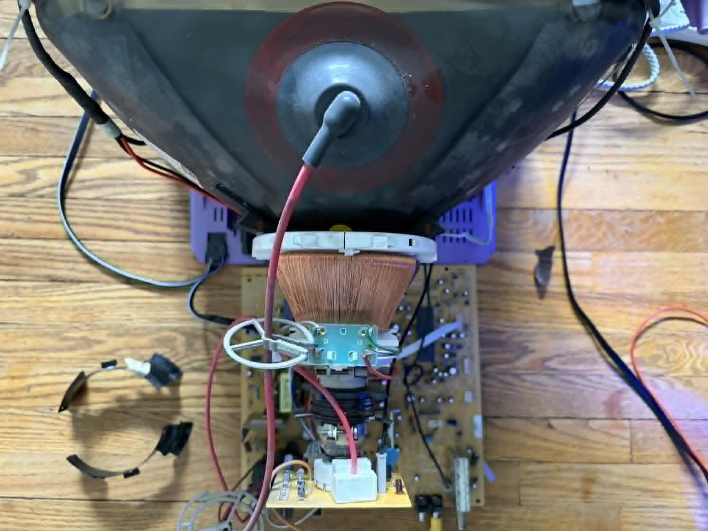
    
<em>Yoke Adjustment (Copper Part)</em>

  

  
The missing screws were sorted out at the hardware store. I just tried different sizes until one was a correct match.

---

## Reassembly & Testing
Powering it back on after reassembly, the black bar was gone and the tilt was corrected. Great progress! But the bowing on the edges was still there.

  

    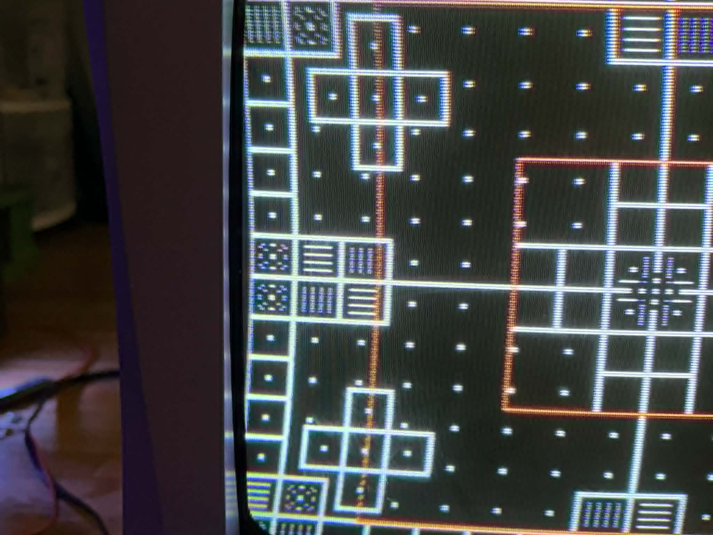
    
<em></em>

  

  

    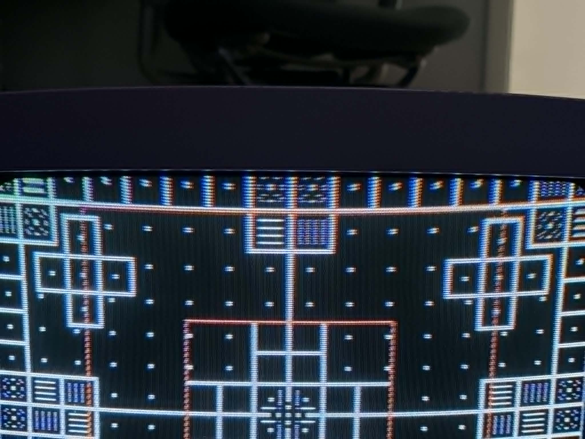
    
<em>Edges of Display Bowing</em>

  

  

    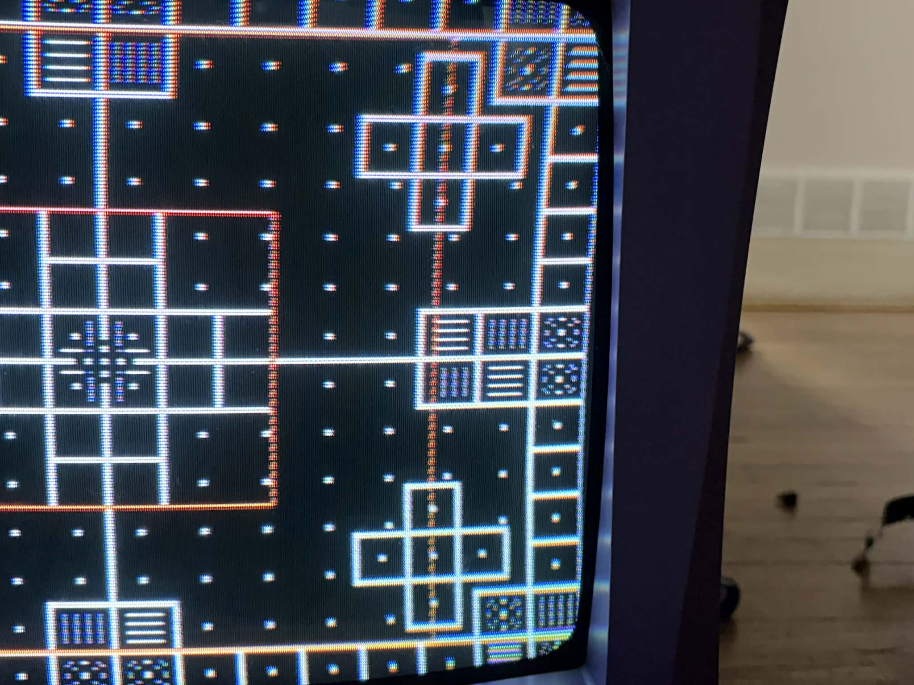
    
<em></em>

  

After some further research, I found out how to access the service menu, a hidden diagnostic menu built into certain TVs. From there I adjusted the pin amplifier setting, which controls the shape of the display geometry, and that corrected the bowing!

  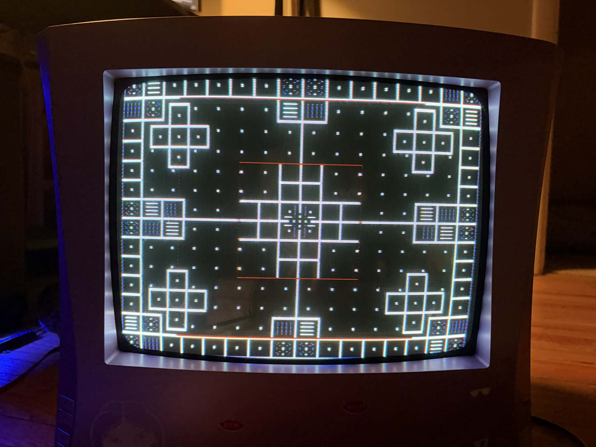
  
<em>Display after pin amplifier adjustment</em>

---

## Final Result
All the display issues were resolved. The display looks fantastic. Beyond the results, this was a valuable hands-on lesson in electronics troubleshooting.

  
  
<em>Fully restored and running</em>

---
[← Back to Home](../)
