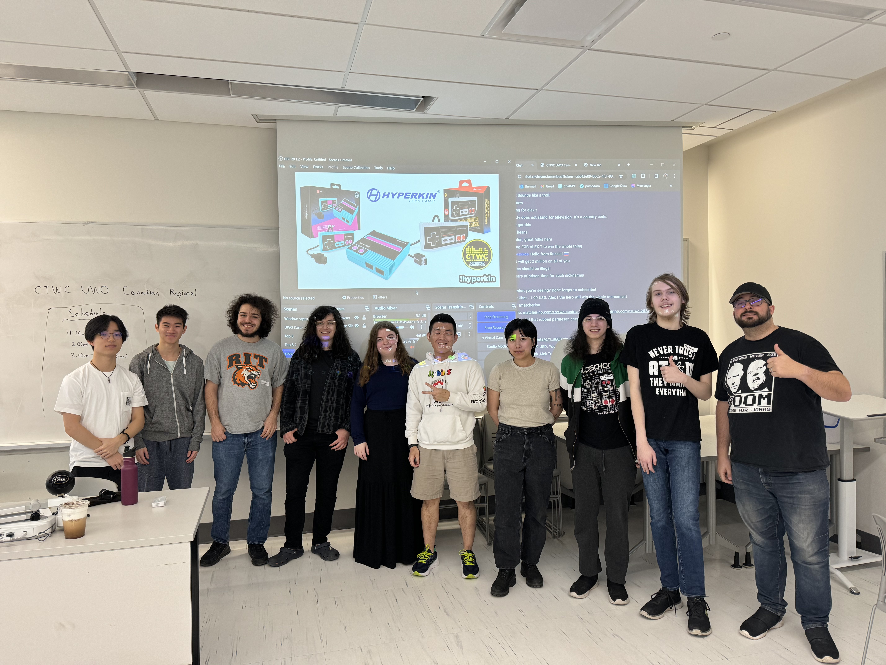
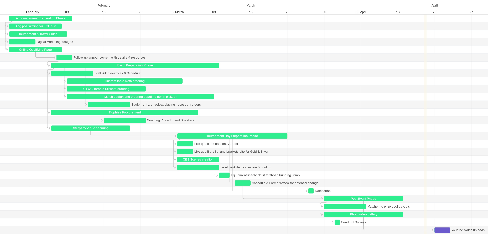
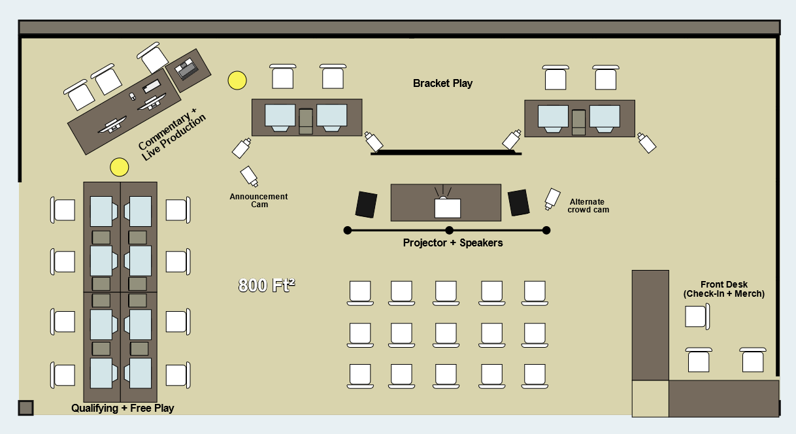
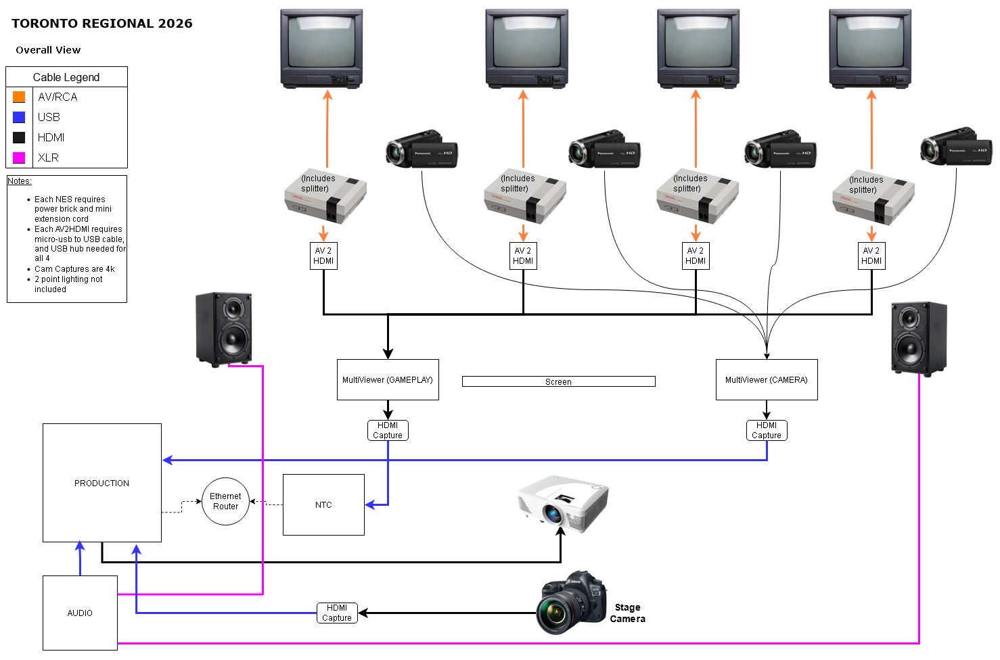
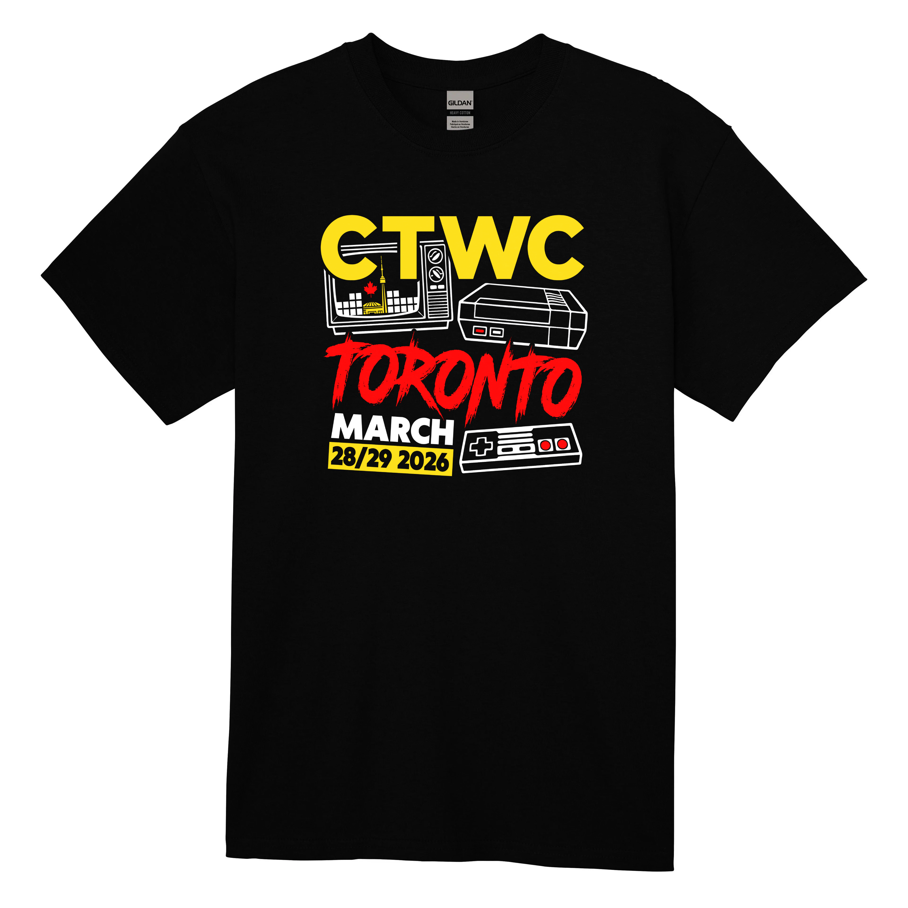
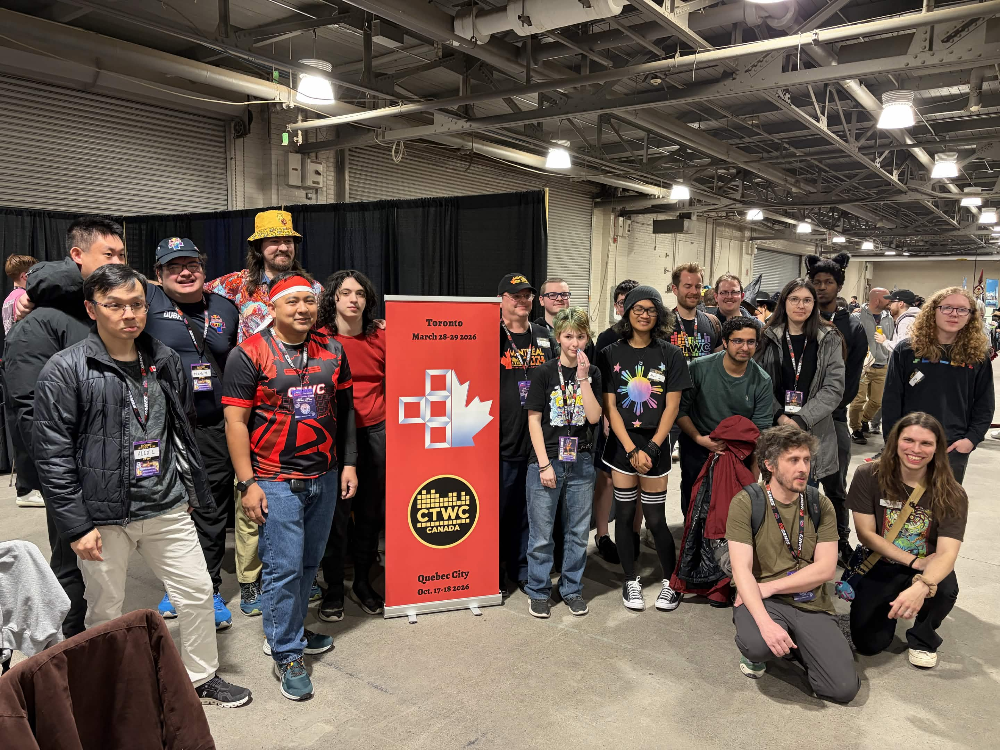

[← Back to Home](../)

# Toronto's First Classic Tetris Tournament

Event Director | March 28-29, 2026 @ Enercare Centre

---
## Project Snapshot

- Led planning and execution of Toronto's first official Classic Tetris regional tournament
- 100+ competitors and spectators across a two-day event
- Managed a team of 10 volunteers across Canada and the U.S.
- Secured venue partnership with Toronto Game Expo
- Delivered on schedule and invited back for 2027

## Background
Competitive Classic Tetris are rare in Canada, with most tournaments taking place in the United States. After attending several U.S. regionals and co-hosting a smaller event at Western University in 2024, I saw an opportunity to launch Toronto's first dedicated Classic Tetris tournament.

This project became a six-month initiative to plan and deliver a full-scale regional event from concept to execution.

  
  
<em>Western University Local Event</em>

---

## Project Initiation

I assembled a volunteer team of 10 members from the Classic Tetris community, including 4 U.S. members. The event was approved as an official CTWC regional tournament, establishing credibility and setting expectations for high-level production.

With approval secured, planning began late September of 2025 with a six-month runway to make it happen.

  
  
<em>Toronto Staff (2 unable to attend)</em>

---

## Venue Partnership & Stakeholder Coordination
Hosting an event in Toronto presented significant cost and logistics challenges. To address this, I pitched a partnership to [Toronto Game Expo](https://www.torontogameexpo.ca/about) (TGE) for their Spring Event, and negotiated a shared-responsibility agreement:

**Toronto Game Expo provided**
- Venue space
- Power and ethernet infastructure
- Tables and chairs

**Our team provided**
- Tournament operations and production
- Gameplay and broadcast equipment
- Staffing and event logistics

This partnership enabled the event to scale larger than what would have been possible independently.

---

## Planning & Project Management
I developed and maintained a master project plan covering:
- Event timeline and milestones
- Volunteer roles and staffing plans
- Equipment and production logistics
- Tournament format and operations
- Marketing and promotion strategy
- Merchandise planning and budgeting
- Electronics signal flow and floor plan

Regular staff meetings were held throughout the planning phase to track progress, assign deliverables, gather feedback, and maintain alignment. Meeting minutes and updates ensured visibility for all team members.

The goal was to run the event to the standard of established regional tournaments rather than a typical inaugural event.

  
  
<em>Event Gantt Chart</em>

  
  
<em>Floor Plan</em>

  
  
<em>Production Signal Flow</em>

---

## Event Enhancements & Attendee Experience

This is where I wanted to really raise the bar. Some of what my team and I put together:
- **Toronto Travel & Tourism Guide** for the roughly 30 Americans attending, some visiting Canada for the first time, to make the trip as easy as possible
- **Custom wooden trophies** for Gold and Silver bracket finalists
- **Limited edition t-shirts** to make the event feel special
- **[Promotional video](https://www.youtube.com/watch?v=15VdB60fx7k)** filmed at Toronto landmarks
- **Promotional live stream** featuring world-class players who were attending
- **Sponsored afterparty** at a booked restaurant to keep the community together after the event 

  
  
<em>Custom Trophies for Finalists</em>

  
  
<em>Limited Edition Event T-shirt Design</em>

---

## Event Weekend
Saturday and Sunday were a lot. We ran out of seats pretty quickly and it turned into standing room only. TGE attendees kept wandering over to watch and staying longer than they probably planned. By the end of the weekend, TGE staff told us we had the biggest crowd of anyone at the expo. Everything ran on time, the level of play was close to world championship calibre, and because I had scheduled roles carefully, I was mostly supervising and handling small things rather than scrambling to keep things together.

  
  
<em>Standing Room Only by Midday Saturday</em>

  
  
<em>Gold Bracket Players</em>

  
  
<em>Silver Bracket Players</em>

---

## The Moments That Made It Worth It
Throughout the weekend, people came up to tell me it was their first Classic Tetris event! Some had been watching online for years but never had anything close enough to attend. A few said they found out through the promotional video and decided to make the trip. People telling me it was worth it, that the event was everything they hoped for, that's what really confirmed the whole thing was worth the six months of work.

That was always the goal. More than a tournament, I wanted to give people a real taste of what the Classic Tetris scene actually is. A community that spans generations, built around a genuine love for the game.

  

    
    
<em>Chatting with 2023 World Champion</em>

  

  

    
    
<em>Commentary Duos</em>

  

  

    
    
<em>Announcing Updates</em>

  

---

## Outcome
It was by all measures a success. Everything ran on time, the competition was incredible, and TGE has already invited us back for next year! This was the biggest project I've ever taken on, and the most rewarding.

---
*Photo credits to David MacDonald*

[← Back to Home](../)
